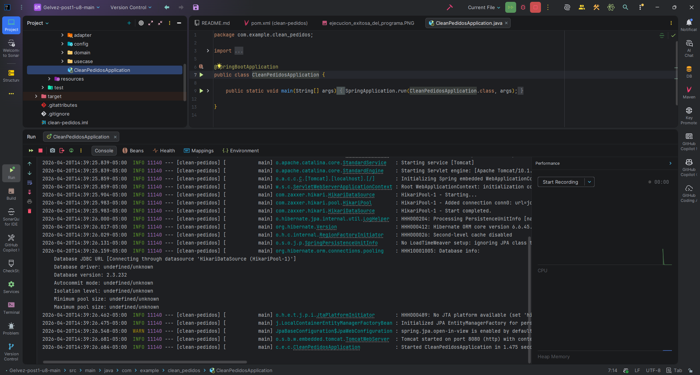
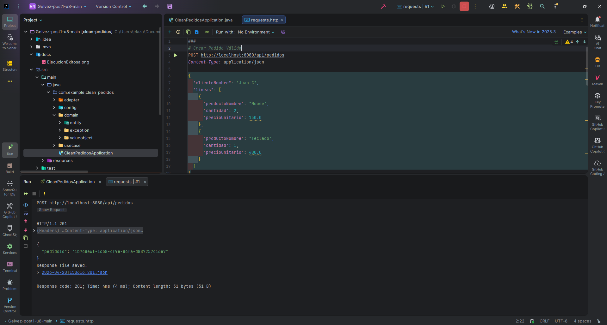
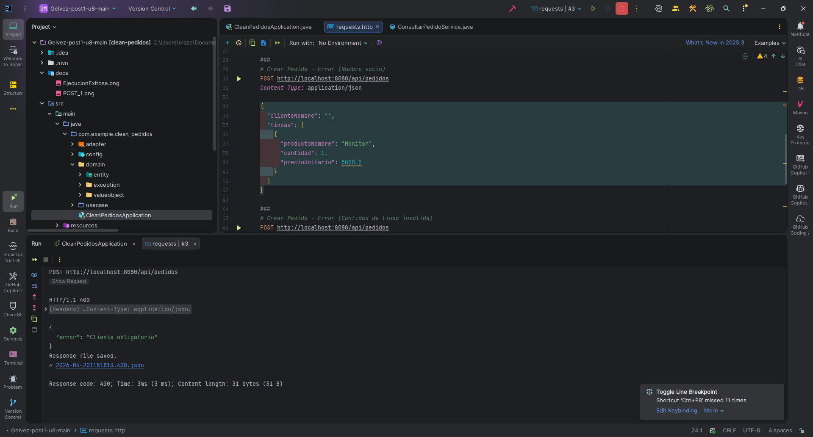
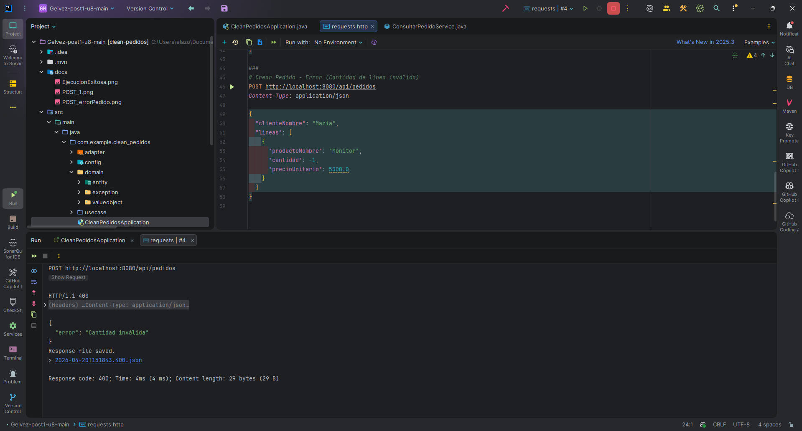

#  Clean Pedidos - Unidad 8
Proyecto implementado con **Clean Architecture** usando Spring Boot.
---
##  Arquitectura del proyecto
El sistema est� dividido en 4 capas siguiendo el principio de inversi�n de dependencias:
`mermaid
graph TD
    A[Frameworks & Drivers: Spring Boot, H2, Tomcat] --> B[Interface Adapters: Controladores REST, JPA Repositories]
    B --> C[Application Business Rules: Casos de Uso, Puertos]
    C --> D[Enterprise Business Rules: Domain Entities, Value Objects, Domain Exceptions]
    style D fill:#a8e6cf,stroke:#333,stroke-width:2px;
    style C fill:#dcedc1,stroke:#333,stroke-width:2px;
    style B fill:#ffd3b6,stroke:#333,stroke-width:2px;
    style A fill:#ffaaa5,stroke:#333,stroke-width:2px;
`
### Descripción del desarrollo
- **Domain:** Entidades de negocio (Pedido) y Value Objects (PedidoId, Dinero, LineaPedido, EstadoPedido). Contiene la l�gica central sin depender de frameworks externos.
- **Use Cases:** L�gica de la aplicaci�n organizando el flujo de los Requests, aplicando inversi�n de dependencias.
- **Adapters:** Controladores REST para la entrada HTTP y adaptadores de persistencia con JPA.
- **Frameworks:** Spring Boot con base de datos en memoria H2.
---
## Instrucciones de Ejecución
1. **Compilar y correr pruebas:**
   `ash
   ./mvnw clean compile test
   `
2. **Levantar la aplicaci�n:**
   `ash
   ./mvnw spring-boot:run
   `
3. **Probar los Endpoints:**
   Abre el archivo 
equests.http ubicado en la ra�z del proyecto que incluye variables globales en IntelliJ IDEA para probar todo de forma fluida.
---
##  Evidencias del sistema (requests.http)
A continuaci�n, las evidencias de las distintas pruebas capturadas ejecutando el archivo **requests.http**:
###  Compilaci�n y Ejecuci�n del programa

###  POST: Pedido creado correctamente

###  POST: Validaci�n de cliente vac�o

###  POST: Validaci�n de cantidad menor a 0

---
#  Autor
Juan Sebastian Gelvez Botia - Universidad de Santander
2026
Codigo: 02230131065
